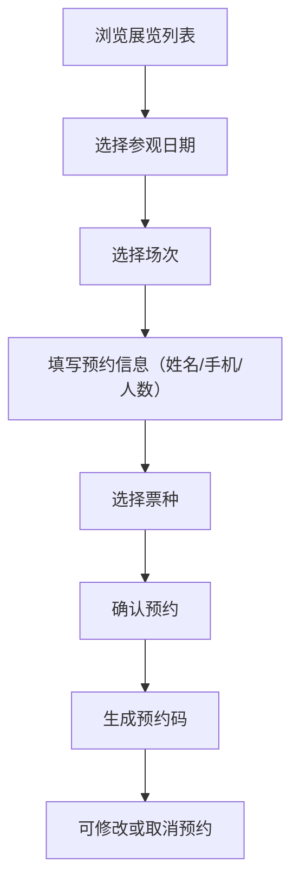
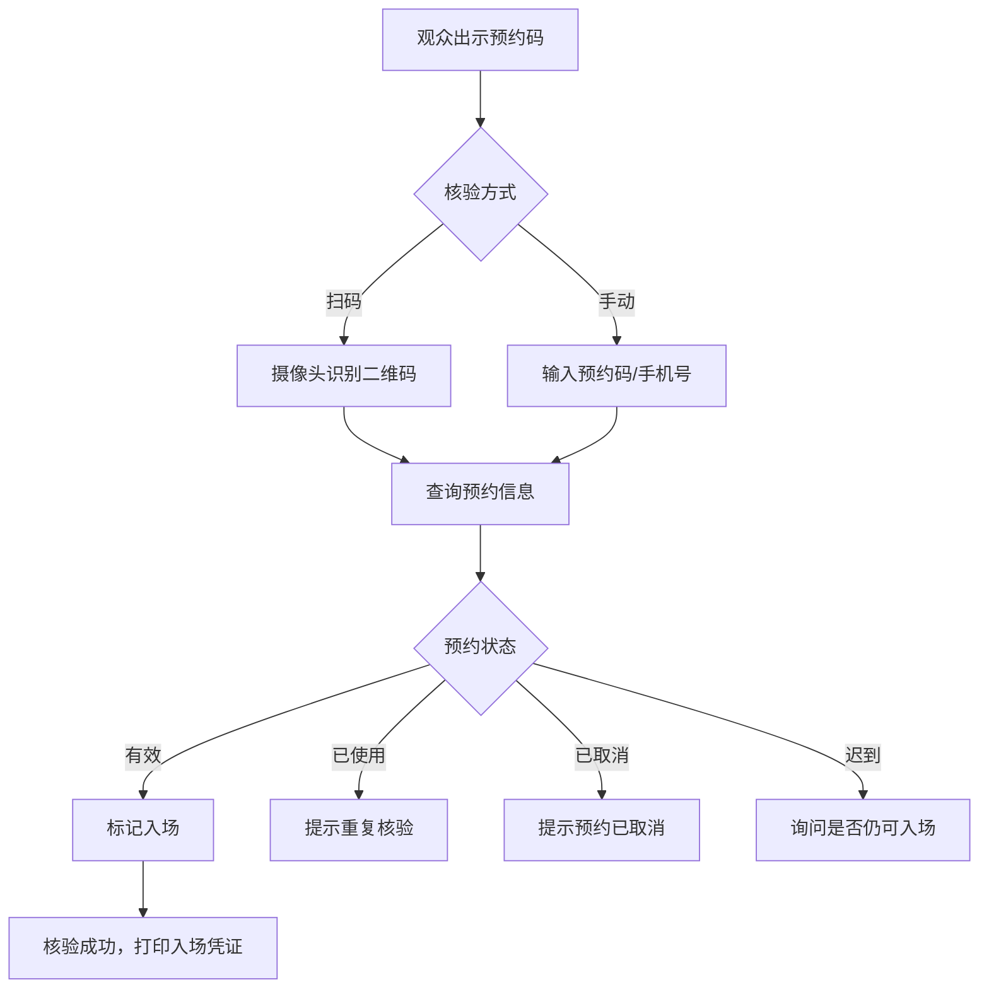
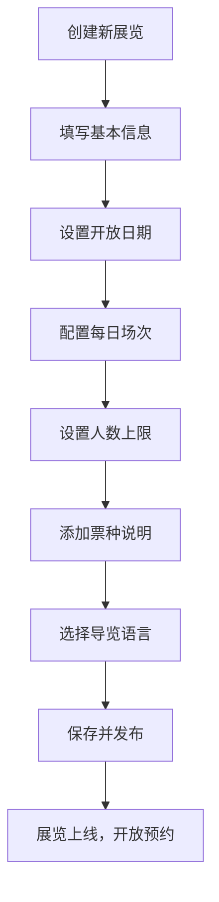

## 1. 产品概述

小型展览馆临时展览与观众预约管理系统，为展览馆提供数字化的展览管理、观众预约、入场核验和数据分析能力，提升运营效率和观众体验。

- 面向对象：展览馆工作人员（展览管理、入场核验、数据查看）和参观观众（在线预约、反馈提交）
- 核心价值：简化预约流程、精确控制人流、收集观众反馈、辅助运营决策

## 2. 核心功能

### 2.1 用户角色

| 角色 | 使用方式 | 核心权限 |
|------|----------|----------|
| 工作人员 | 系统登录 | 展览管理、入场核验、数据查看、公告发布、名单导出 |
| 观众 | 公开访问 | 展览浏览、场次预约、预约修改/取消、反馈提交 |

### 2.2 功能模块

1. **数据概览页**：预约趋势、到场率、热门时段、余票提醒、公告发布、名单导出
2. **展览管理页**：展览信息创建、开放日期设置、每日场次、人数上限、票种说明、导览语言
3. **预约日历页**：日历视图、场次选择、人数填写、预约码生成、预约修改/取消
4. **入场核验页**：扫码核验、手动搜索、迟到标记、团体入场、核验记录
5. **观众反馈页**：评分提交、留言评价、感兴趣展品收集、反馈列表查看

### 2.3 页面详情

| 页面名称 | 模块名称 | 功能描述 |
|---------|----------|----------|
| 数据概览页 | 预约趋势图表 | 按日期展示预约数量折线图，支持近7天/30天切换 |
| 数据概览页 | 到场率统计 | 展示总预约数、实到数、到场率百分比 |
| 数据概览页 | 热门时段分析 | 按时段统计入场人数，热力展示 |
| 数据概览页 | 余票提醒 | 展示各展览剩余票数，低于阈值高亮预警 |
| 数据概览页 | 公告发布 | 发布、编辑、删除系统公告 |
| 数据概览页 | 名单导出 | 按展览/日期导出预约名单为Excel/CSV |
| 展览管理页 | 展览列表 | 展示所有展览，支持上下线、编辑、删除 |
| 展览管理页 | 展览创建/编辑 | 填写展览名称、简介、封面图、开放日期范围 |
| 展览管理页 | 场次配置 | 设置每日场次时间、单场人数上限 |
| 展览管理页 | 票种管理 | 设置票种名称、价格、说明 |
| 展览管理页 | 导览语言 | 选择支持的导览语言（中文/英文/日文等） |
| 预约日历页 | 日历视图 | 月历展示，可选择日期查看场次 |
| 预约日历页 | 场次选择 | 展示当日所有场次及余票状态 |
| 预约日历页 | 预约表单 | 填写观众信息、人数、票种 |
| 预约日历页 | 预约码展示 | 预约成功后生成二维码和预约编号 |
| 预约日历页 | 我的预约 | 查看历史预约，支持修改和取消 |
| 入场核验页 | 扫码核验 | 摄像头扫描预约二维码快速核验 |
| 入场核验页 | 手动搜索 | 输入预约码/手机号搜索核验 |
| 入场核验页 | 核验操作 | 标记已入场、迟到、取消核验 |
| 入场核验页 | 团体入场 | 批量核验多人预约 |
| 入场核验页 | 核验记录 | 展示当日核验记录列表 |
| 观众反馈页 | 评分组件 | 1-5星评分，分项评分（展览内容/导览服务/场馆环境） |
| 观众反馈页 | 留言输入 | 文字留言反馈 |
| 观众反馈页 | 展品选择 | 多选感兴趣的展品 |
| 观众反馈页 | 反馈提交 | 提交反馈并展示感谢页 |
| 观众反馈页 | 反馈列表 | 工作人员查看所有反馈 |

## 3. 核心流程

### 3.1 观众预约流程

### 3.2 入场核验流程

### 3.3 展览管理流程

## 4. 界面设计

### 4.1 设计风格

**设计基调：** 文化艺术感、简约精致、专业可靠

- **主色调**：深靛蓝 `#1E3A5F`（专业、稳重）
- **辅助色**：暖金色 `#D4AF37`（艺术、品质）、青瓷绿 `#5B8C5A`（自然、清新）
- **背景色**：米白色 `#F8F5F0`（温暖、舒适）、深灰 `#2C2C2C`
- **字体**：标题使用「思源宋体」彰显文化底蕴，正文使用「Inter」保证可读性
- **按钮风格**：圆角矩形，微立体效果，悬停时轻微上浮
- **卡片风格**：白色背景，柔和阴影，圆角 8px，边框细描边
- **图标风格**：线性图标，统一 stroke 宽度，简洁现代

### 4.2 页面设计概览

| 页面名称 | 模块名称 | UI元素 |
|---------|----------|--------|
| 数据概览页 | 数据卡片 | 渐变背景 + 数字动画 + 趋势箭头 |
| 数据概览页 | 趋势图表 | 渐变色折线图，平滑曲线，数据点高亮 |
| 数据概览页 | 热门时段 | 热力图格子，颜色深浅表示热度 |
| 数据概览页 | 公告栏 | 滚动轮播，最新公告置顶标红 |
| 展览管理页 | 展览卡片 | 封面图 + 展览信息叠加，悬浮放大效果 |
| 展览管理页 | 表单弹窗 | 毛玻璃背景，分区表单，步骤指示器 |
| 预约日历页 | 日历组件 | 月历格子，日期圆点标记场次状态，选中日期高亮 |
| 预约日历页 | 场次列表 | 时间轴布局，余票进度条，按钮状态联动 |
| 预约日历页 | 预约码 | 大尺寸二维码，编号醒目，保存到相册按钮 |
| 入场核验页 | 扫码区域 | 全屏取景框，扫描线动画，识别成功音效提示 |
| 入场核验页 | 核验结果 | 成功绿色动效 + 失败红色抖动反馈 |
| 观众反馈页 | 评分组件 | 星形点击动效，分项评分滑块，表情反馈 |
| 观众反馈页 | 展品选择 | 网格布局，多选卡片，选中放大描边 |

### 4.3 响应式设计

- **设计策略**：桌面端优先，移动端自适应
- **断点设置**：1200px（桌面）、768px（平板）、480px（手机）
- **移动端适配**：
  - 侧边导航转为底部 Tab 栏
  - 多列布局转为单列流式布局
  - 表格组件转为卡片列表
  - 表单输入优化触控体验，增大点击区域
  - 扫码核验优化为全屏模式

### 4.4 动画与交互

- **页面加载**：元素淡入 + 轻微上移动画，按区块顺序延迟出现
- **数据更新**：数字滚动动画，图表线条绘制动画
- **按钮交互**：点击时缩放 0.95 → 1，颜色渐变过渡
- **表单反馈**：输入错误时输入框轻微左右抖动，错误消息滑入
- **核验成功**：绿色圆形扩散动画 + 对勾绘制动画
- **日历切换**：月份切换时整页平滑滑动过渡
