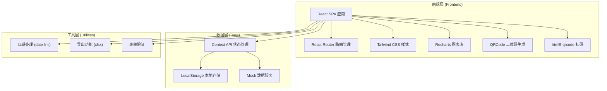
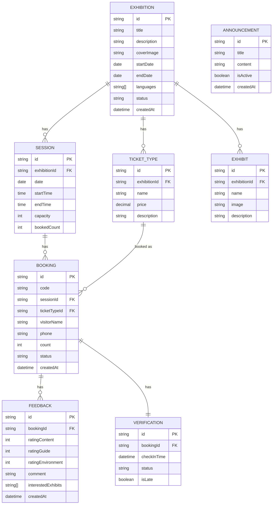

## 1. 架构设计



## 2. 技术选型

| 分类 | 技术栈 | 版本 | 用途 |
|------|--------|------|------|
| 前端框架 | React | 18.x | 用户界面构建 |
| 构建工具 | Vite | 5.x | 开发构建 |
| 语言 | TypeScript | 5.x | 类型安全 |
| 样式方案 | Tailwind CSS | 3.x | 原子化样式 |
| 路由 | React Router Dom | 6.x | 单页路由 |
| 图表 | Recharts | 2.x | 数据可视化 |
| 二维码 | qrcode.react | 3.x | 预约码生成 |
| 扫码 | html5-qrcode | 2.x | 扫码核验 |
| 日期处理 | date-fns | 3.x | 日期格式化与计算 |
| 导出 | xlsx | 0.18.x | Excel导出 |
| 状态管理 | React Context | 18.x | 全局状态 |
| 存储 | LocalStorage API | - | 本地持久化 |

## 3. 路由定义

| 路由路径 | 页面名称 | 权限 | 说明 |
|---------|---------|------|------|
| `/` | 数据概览页 | 工作人员 | 首页，展示运营数据看板 |
| `/exhibitions` | 展览管理页 | 工作人员 | 展览列表、创建、编辑 |
| `/exhibitions/new` | 创建展览页 | 工作人员 | 新建展览表单 |
| `/exhibitions/:id/edit` | 编辑展览页 | 工作人员 | 编辑已有展览 |
| `/booking` | 预约日历页 | 公开 | 观众预约入口 |
| `/booking/success` | 预约成功页 | 公开 | 展示预约码 |
| `/booking/my` | 我的预约页 | 公开 | 查看和修改预约 |
| `/verification` | 入场核验页 | 工作人员 | 扫码/手动核验 |
| `/feedback` | 观众反馈页 | 公开 | 提交反馈 |
| `/feedback/list` | 反馈列表页 | 工作人员 | 查看所有反馈 |

## 4. 数据模型

### 4.1 ER 图



### 4.2 核心数据结构定义

```typescript
// 展览
interface Exhibition {
  id: string;
  title: string;
  description: string;
  coverImage: string;
  startDate: string;
  endDate: string;
  languages: string[];
  status: 'draft' | 'active' | 'ended';
  createdAt: string;
}

// 场次
interface Session {
  id: string;
  exhibitionId: string;
  date: string;
  startTime: string;
  endTime: string;
  capacity: number;
  bookedCount: number;
}

// 票种
interface TicketType {
  id: string;
  exhibitionId: string;
  name: string;
  price: number;
  description: string;
}

// 展品
interface Exhibit {
  id: string;
  exhibitionId: string;
  name: string;
  image: string;
  description: string;
}

// 预约
interface Booking {
  id: string;
  code: string;
  sessionId: string;
  ticketTypeId: string;
  visitorName: string;
  phone: string;
  count: number;
  status: 'pending' | 'confirmed' | 'checked_in' | 'cancelled';
  createdAt: string;
}

// 核验记录
interface Verification {
  id: string;
  bookingId: string;
  checkInTime: string;
  status: 'success' | 'failed' | 'late';
  isLate: boolean;
}

// 反馈
interface Feedback {
  id: string;
  bookingId: string;
  ratingContent: number;
  ratingGuide: number;
  ratingEnvironment: number;
  comment: string;
  interestedExhibits: string[];
  createdAt: string;
}

// 公告
interface Announcement {
  id: string;
  title: string;
  content: string;
  isActive: boolean;
  createdAt: string;
}
```

## 5. 目录结构

```
src/
├── components/           # 公共组件
│   ├── Layout/          # 布局组件
│   │   ├── Header.tsx
│   │   ├── Sidebar.tsx
│   │   └── MobileTabs.tsx
│   ├── ui/              # 基础UI组件
│   │   ├── Button.tsx
│   │   ├── Input.tsx
│   │   ├── Modal.tsx
│   │   ├── Card.tsx
│   │   ├── Table.tsx
│   │   └── Loading.tsx
│   └── features/        # 业务组件
│       ├── Calendar.tsx
│       ├── QRCodeDisplay.tsx
│       ├── Scanner.tsx
│       ├── StarRating.tsx
│       └── StatsCard.tsx
├── pages/               # 页面组件
│   ├── Dashboard/
│   │   └── index.tsx
│   ├── Exhibition/
│   │   ├── List.tsx
│   │   ├── Form.tsx
│   │   └── index.tsx
│   ├── Booking/
│   │   ├── Calendar.tsx
│   │   ├── Form.tsx
│   │   ├── Success.tsx
│   │   ├── MyBookings.tsx
│   │   └── index.tsx
│   ├── Verification/
│   │   └── index.tsx
│   └── Feedback/
│       ├── Submit.tsx
│       ├── List.tsx
│       └── index.tsx
├── context/             # 状态管理
│   ├── AppContext.tsx
│   ├── ExhibitionContext.tsx
│   └── BookingContext.tsx
├── services/            # 数据服务
│   ├── storage.ts       # LocalStorage 封装
│   ├── mockData.ts      # Mock 数据
│   ├── exhibitionService.ts
│   ├── bookingService.ts
│   ├── verificationService.ts
│   └── feedbackService.ts
├── utils/               # 工具函数
│   ├── date.ts          # 日期处理
│   ├── export.ts        # 导出功能
│   ├── validation.ts    # 表单验证
│   └── qrcode.ts        # 二维码工具
├── types/               # 类型定义
│   └── index.ts
├── App.tsx
├── main.tsx
└── index.css
```

## 6. 核心技术实现要点

### 6.1 本地存储设计

使用 LocalStorage 模拟后端数据库，数据结构：
- `exhibitions`: 展览列表
- `sessions`: 场次列表
- `ticketTypes`: 票种列表
- `bookings`: 预约列表
- `verifications`: 核验记录
- `feedbacks`: 反馈列表
- `announcements`: 公告列表

### 6.2 预约码生成规则

格式：`EXH` + 8位随机字符 + 日期（MMDD）
示例：`EXH-A3F9K2B7-0615`

### 6.3 余票计算逻辑

```typescript
// 实时计算剩余票数
const getRemainingTickets = (session: Session): number => {
  return session.capacity - session.bookedCount;
};

// 批量预约校验
const validateBooking = (session: Session, count: number): boolean => {
  return getRemainingTickets(session) >= count;
};
```

### 6.4 扫码核验实现

使用 `html5-qrcode` 库实现摄像头扫码，支持：
- 后置摄像头优先
- 手电筒控制
- 识别成功音效反馈
- 手动输入备选

### 6.5 数据导出功能

使用 `xlsx` 库导出 Excel：
- 按展览筛选
- 按日期范围筛选
- 导出字段：预约码、姓名、手机、人数、场次、状态
